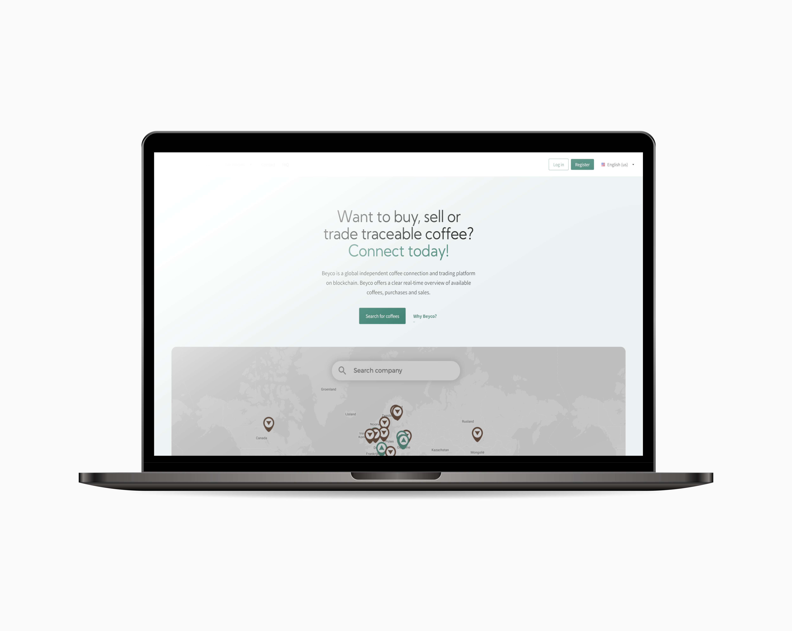
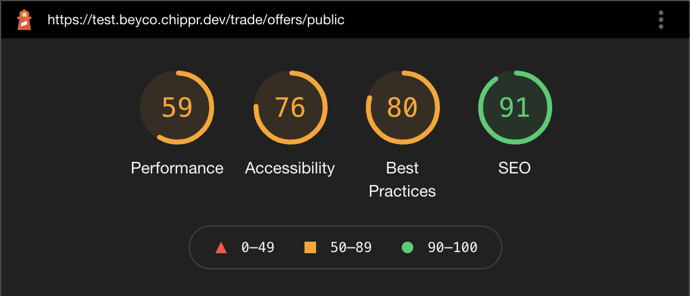
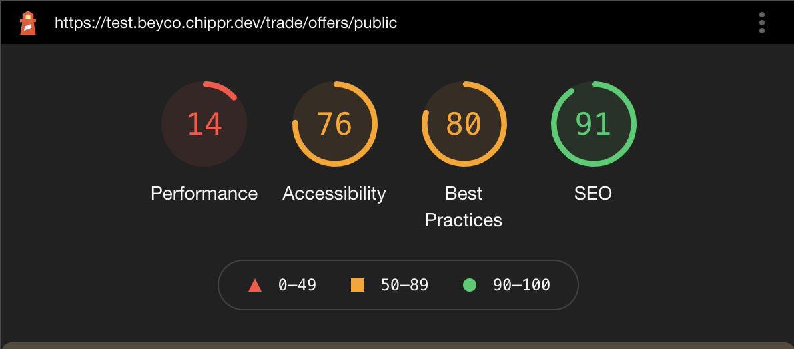
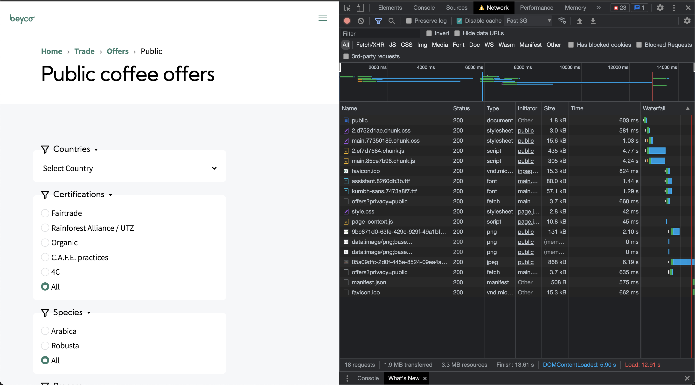
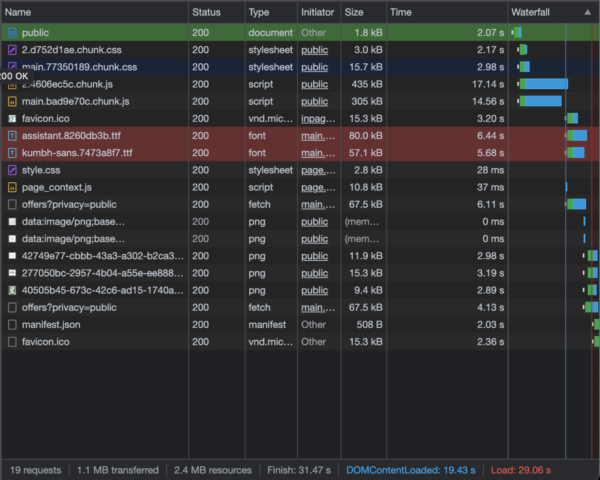

# Rapportage webtoegankelijkheid-test voor Chippr Beyco



Dit document is een webtoegankelijkheid-test volgens de Web Content Accessibility Guidelines (WCAG). Een consistente rapportage helpt bij het uitvoeren van een evaluatie en zorgt er voor dat verschillende tests kunnen worden vergeleken.

Datum webtoegankelijkheid-test: 
27 oktober 2021, 
28 oktober 2021, 
1 november 2021,
2 november 2021

Webtoegankelijkheid-test uitgevoerd door: Justin Lung, Chaan Soekana, Armando Jubitana, Daan Korver, Daphne Zwuup & Finn van Bekkum

## Inhoudsopgave

- [Samenvatting](#samenvatting)
- [Achtergrond bij de evaluatie](#achtergrond_evaluatie)
- [Afbakening](#afbakening)
- [Testresultaten en aanbevelingen](#testresultaten_aanbevelingen)
- [Referenties](#referenties)
- [Bijlagen](#bijlagen)
- [Licentie](#licentie)

## Samenvatting

Dit rapport beschrijft in hoeverre de website [beyco.nl](https://www/beyco.nl) overeenstemt met de Web Content Accessibility Guidelines (WCAG) van het W3C. Na de achtergrondinformatie en afbakening van de test worden beoordelaars, beoordelingsproces en testresulltaten beschreven.

Conslusie van deze test luidt dat de Beyco website niet voldoet de WCAG 2.1, op niveau AA. Gedetailleerde resultaten en aanbevelingen zijn verderop in dit document beschikbaar en in de referenties vindt u bronnen voor eventuele vervolgstudie. Wij stellen feedback op deze evaluatie zeer op prijs.

## Achtergrond bij de evaluatie

De webtoegankelijkheid-test vereist een combinatie van semi-geautomatiseerde en handmatig uitgevoerde evaluatie tools door een ervaren beoordelaar. De beoordelingsresultaten in dit rapport zijn gebaseerd op een beoordeling welke is uitgevoerd op 28-10-2021. De website kan ondertussen aangepast zijn.

## Afbakening

[beyco.nl](https://www.beyco.nl)

Beyco is een platform waarbij je je koffie kan kopen en verkopen.

URLs die mee zijn genomen in de beoordeling:

- [www.beyco.nl](https://www.beyco.nl)
- [www.beyco.nl/trade/offers/public](https://beyco.nl/trade/offers/public)
- [www.beyco.nl/trade/offers/{offer_id}](https://beyco.nl/trade/offers/a648e729-9808-497f-a001-6e6e027f72a7)

Test data:

- 28-10-2021
- 29-10-2021
- 01-11-2021

Taal website: Engels

## Beoordelaars

Daan Korver  
Student  
daan.korver@hva.nl  
Nederlands

Justin Lung
Student
justin.lung@hva.nl
Nederlands

Chaan Soekana
Student
chaan.soekana@hva.nl
Nederlands

Daphne Zwuup
Student
daphne.zwuup@hva.nl
Nederlands

Finn van Bekkum
Student
finn.van.bekkum@hva.nl
Nederlands

Armando Jubitana
Student
armando.jubitana@hva.nl
Nederlands

## Beoordelingsproces

Deze beoordelings is uitgevoerd op WCAG 2.1 Niveau AA

De tools die zijn gebruikt voor deze beoordeling zijn de volgende:

- [A11Y Checklist](https://www.a11yproject.com/checklist/)
- [WCAG Guidelines Overview](https://www.w3.org/WAI/standards-guidelines/wcag/)
- [Google Lighthouse](https://developers.google.com/web/tools/lighthouse)

## Testresultaten en aanbevelingen

De huidige website van Beyco voldoet niet nivea AA van de WCAG 2.1. Om deze score toch te behalen zijn er een paar aanbevelingen.

### Home Pagina

- Zorg dat labels de juiste attributen bevatten en dat er een duidelijke tekst in staat.
- Zorg dat het contrast van normale tekst een minimum ratio hebben van 4.5:1 en die van grote teksten een minimum 3:1
- Zorg dat alle elementen van de website altijd in beeld blijven, zelfs als je gaat zoomen.
- Zorg dat er geen horizontale scroll aanwezig is en dat de content niet naar de zijkant word gepushed op kleine schermen zoals Iphone 5
- Zorg dat er genoeg scroll ruimte is op mobile.

### Coffee Page

- Zorg ervoor dat je gemakkelijk door de pagina kan tabben. Hou hierbij rekening met dropdown menu's. Voeg ook een skip-link toe en zorg ervoor dat er geen onzichtbare knoppen aanwezig zijn.

- Zorg ervoor dat de pagina toegankelijk is voor screenreaders. Ook hierbij is het van belang dat er een skip link aanwezig is en je gemakkelijk door de pagina kan navigeren door te tabben. Daarnaast moeten image elementen een alt beschrijving hebben.

## Ontoegankelijke punten

### Home Pagina

- Label elementen missen het `for` attribuut en bevatten geen tekst
- In de footer is er een input om jezelf in te schrijven voor de nieuwsbrief. Als je hier een verkeerd email adress invoerd krijg je een error. Het contrast van deze error is niet goed.
- Bij 200% Zoom gaan sommige elementen uit het beeld. Dit geld vooral voor het kopje van "Search for coffees"
- Het contrast van de groene en witte/grijze kleur is niet goed genoeg.
- Op kleinere telefoons zoals Iphone 5 is er aan de rechterkant witruimte die zich over de hele lengte van de site verspreid.
- Bij de sectie van "Search your coffees" is er niet genoeg ruimte voor de gebruiker om te scrollen. Het zou zo maar kunnen dat je perongeluk 1 van de bedrijven aanklikt waardor je weer terug moet gaan naar de vorige pagina.
- De inhoud van een button is niet uniek en beschrijvend.
- Social icons hebben geen goede benaming voor de focus.
- Sommige elementen hebben geen zichtbare focusstijl
- Sla geen heading levels over.

### Koffie Pagina

- Na het invoeren van een input veld, krijg je een error message te zien. Deze error message wordt alleen met tekst aangeduid. Dit kan worden verbeterd doormiddel van kleur (Een rooie kleur zou goed zijn om aan te duiden dat er geen zoekresultaten zijn). Hierdoor verbeterd de accessibility voor mensen met een beperking ook.

- De toetsenbord navigatie is niet toegankelijk. Sommige dropdown menu's zijn niet navigeerbaar met de toetsenbord en er is geen skip link aanwezig.

- Er is geen rekening gehouden met screenreaders. Image elementen hebben geen alt beschrijving en er zijn onzichtbare knoppen aanwezig.

### Detail Pagina

- In de code staan veel lege div elementen.
- Vermijd het gebruik van het autofocus attribuut bij de iframe van de kaart. 
- Bij de iframe van de kaart wordt er een aantal keer getabt op elementen die niet zichtbaar zijn.
- De social media logo's in de footer krijgen geen focus style bij het tabben.
- Kleurencontrast van kleinere letterypes zijn slecht leesbaar en voldoet niet aan contrast ratio.
  met lichtgrijs aan de voorgrond met witte achtergrond.


### Checklist

#### Content

##### Home Pagina
- **Use plain language and avoid figures of speech, idioms, and complicated metaphors.**  
  Het lees level moet level 8 zijn. De lees level in deze pagina is 11.17. Dus de lees level 
  van de website is goed.
- **Make sure that button, a, and label element content is unique and descriptive.**  
  Daarom is de code van deze button is gefaald: `<button type="button" class="menu-icon-container">`. De class is niet duidelijk genoeg.
- **Use left-aligned text for left-to-right (LTR) languages, and right-aligned text for right-to-left (RTL) languages.**  
  De koppen en bodytekst zijn in de css center aligned. Alleen de tekst in de footer en in de menu is standaard left-aligned.

##### Koffie Pagina
- **Use plain language and avoid figures of speech, idioms, and complicated metaphors.**  
  Het taalgebruik is duidelijk en er worden geen stijlfiguren of metaforen gebruikt.
- **Make sure that button, a, and label element content is unique and descriptive.**  
Sommige buttons zijn wat minder duidelijk; ‘Learn more’ geeft weinig context.
- **Use left-aligned text for left-to-right (LTR) languages, and right-aligned text for right-to-left (RTL) languages.**  
De pagina bevat weinig tekst maar ze worden wel links uitgelijnd. Tekst dat in het midden of uitgevuld is uitgelijnd is moeilijk te lezen. Mocht de meertaligheid uitbreiden, zou er voor de Arabische uitwerking een nieuw design moeten worden gemaakt, hierbij moeten de teksten namelijk rechts uitgelijnd zijn.

#### Global code

##### Home Pagina
- **Validate your HTML**  
  De website had alleen maar een waarschuwing. De waarschuwing kan je nog een keer zien op deze link in de html validator: https://validator.w3.org/nu/?doc=https%3A%2F%2Ftest.beyco.chippr.dev%2F
- **Use a lang attribute on the html element.**  
  De code voor de lang ziet er goed uit. Dit is de code van het lang attribuut van Beyco: <html lang="en-us"></html>.
- **Provide a unique title for each page or view.**  
  De titel van de homepagina is goed vernoemd. De titel van de homepagina is: Worldwide Coffee Trading Platform - Beyco.
- **Ensure that viewport zoom is not disabled.**  
  De viewport van de website is niet uitgeschakeld.
  Hier is de code van de viewport: <meta name="viewport" content="width=device-width,initial-scale=1">
- **Use landmark elements to indicate important content regions.**  
  De homepagina heeft geen main met sections daarin. Ze hebben in plaats daarvan alleen divs gebruikt. In plaats van de main hebben ze een div gebruikt met de id root en daarin andere divs gezet.

  Ze hebben wel een header met daarin een nav en onderin een footer.
- **Ensure a linear content flow.**  
  De homepagina heeft geen tabindex. Dus dit is niet bij hun van toepassing.
- **Avoid using the autofocus attribute.**  
  Beyco heeft geen autofocus gebruikt. Dus dit is niet bij hun van toepassing.
- **Remove title attribute tooltips.**  
  Beyco heeft geen extra titles. Dus dit is niet bij hun van toepassing.
  
##### Koffie Pagina
  n.v.t.
  
##### Detail Pagina
  
- **Validate your HTML.**   
Hij geeft aan dat er geen lang attribute aanwezig is in de HTML start tag. Maar als ik zelf in de inspector kijk zie ik wel een lang attribute staan. Misschien dat lang="en-us" een ongeldige waarde is. Ook kom ik veel lege div elementen tegen in de code. 
Verder staat er geen heading in de body element. Deze staan overigens wel in de main element. 

- **Avoid using the autofocus attribute.**
Mensen die blind of slechtziend zijn, kunnen gedesoriënteerd raken wanneer de focus zomaar wordt verplaatst. Ook kan het voor mensen met een motorische handicap voor problemen zorgen, omdat het voor hen extra werk kan opleveren om vanuit het autofocusgebied naar andere locaties op de pagina te navigeren.
  
#### Keyboard

##### Home Pagina
- **Make sure there is a visible focus style for interactive elements that are navigated to via keyboard input.**  
  Search for coffees figures/cards zijn onduidelijk voor screenreaders. Het heeft teveel tekst waardoor het moeilijk te begrijpen op een screenreader.

  Social icons hebben geen goede benaming voor de focus.
  Hier zijn de gefaalde elementen:
```html
<a class="interactive interactive-link layout layout-row gap-small align-cross-center" href="/">
<a href="https://www.instagram.com/beyco.nl/">
<a href="https://www.linkedin.com/company/beyco-nl/">
```
- **Check to see that keyboard focus order matches the visual layout.**  
  Je kan makkelijk de tab toets op het toetsenbord gebruiken om naar interactieve elementen te gaan. Alle elementen zitten in de juiste volgorde.
  
##### Koffie Pagina
- **Make sure there is a visible focus style for interactive elements that are navigated to via keyboard input.**
  Bij de interactieve elementen is er een focus state.
- **Check to see that keyboard focus order matches the visual layout.**
  De focus state past binnen de huisstijl.
- **Remove invisible focusable elements.** 
  Helaas zijn niet alle dropdown menu’s navigeerbaar met toetsenbord en zijn er onzichtbare knoppen aanwezig.

- **
  
#### Detail Pagina
 - **Make sure there is a visible focus style for interactive elements that are navigated to via keyboard input.**
In de footer komt bij de social media logo's geen focus style zoals bij de links.

- **Remove invisible focusable elements.**
Bij de iframe van de kaart wordt er een aantal keer getabt op elementen die niet zichtbaar zijn.
  
#### Images

##### Home Pagina
- **Make sure that all img elements have an alt attribute.**
  BijBeyco heeft geen alt in de foto van de map.
  Code van de afbeelding zonder alt:
```html
`
```

##### Koffie Pagina
- **Make sure that all img elements have an alt attribute.**
  De image elementen op deze pagina hebben geen alt. 
- **For images containing text, make sure the alt description includes the image's text.**
  Bij afbeeldingen met tekst (zoals logo’s) moet de alt beschrijving ook de tekst die in de afbeelding staat bevatten.

#### Headings

##### Home Pagina
- **Use heading elements to introduce content.**
  De homepagina heeft headings.
- **Use only one h1 element per page or view.**
  Er zit alleen maar een h1 element op de homepagina.
- **Don't skip heading levels.**
  De kleine kopjes in de "How does it work?" gedeelte zijn h4 in plaats van h3.

##### Koffie Pagina
- **Use heading elements to introduce content.**
  Headings worden goed gebruikt om content de introduceren. 
- **Use only one h1 element per page or view.**
  Er is maar 1 h1 element gebruikt op de pagina.
- **Heading elements should be written in a logical sequence.**
  De headings staan in een logische volgorde.
- **Don't skip heading levels.**
  Er worden geen heading niveaus overgeslagen.

#### Lists
  
  ##### Home Pagina
  n.v.t.

  #### Detail Pagina
 - **Use list elements (ol, ul, and dl elements) for list content.**
In de header wordt bij de nav geen ul gebruikt en in de footer ook niet.

##### Koffie Pagina
n.v.t.

#### Controls

##### Home Pagina
- **Use the a element for links.**
  De links van de homepagina hebben allemaal een a href.
- **Ensure that controls have :focus states.**
  Alleen de social media links in de footer hebben geen focus state.
- **Use the button element for buttons.**
  De knoppen hebben een button element. Maar zijn niet duidelijk beschreven voor de screenreaders.
- **Provide a skip link and make sure that it is visible when focused.**
  De homepagina heeft geen skip content link.
- **De homepagina heeft geen links die naar een nieuw tabblad of venster gaan.**
  De homepagina heeft geen links die naar een nieuw tabblad of venster gaan. 

##### Koffie Pagina
- **Ensure that controls have :focus states.**
  De social media icons in de footer hebben geen focus state.
- **Use the button element for buttons.**
  Buttons gebruiken wel een button element maar hebben geen toegankelijke beschrijving voor screenreaders.
- **Provide a skip link and make sure that it is visible when focused.**
  Er is geen skip link aanwezig. Met deze hyperlinks – meestal onzichtbaar voor de gemiddelde gebruiker – kunnen gebruikers van een screenreader delen van de pagina overslaan (vandaar ‘skip’) en direct navigeren naar waar bv. het hoofdmenu, de zoekfunctie of juist de content begint.
  
  #### Detail Pagina
-  **Provide a skip link and make sure that it is visible when focused.**
Maak gebruik van skip links voor screen readers en keyboard-only gebruikers.
  
#### Tables
n.v.t.
#### Forms

##### Koffie Pagina

- **All inputs in a form are associated with a corresponding label element.**
  Alle inputs in een form, worden geassocieerd met een label element. Echter kan het nog verbeterd worden om de input types bij een label een for/id te geven zodat de hoogste technologie van een browser het wordt support.
- **Use fieldset and legend elements where appropriate.**
  Er worden goed gebruik gemaakt van fieldsets & legends.
- **Inputs use autocomplete where appropriate.**
  Er wordt gebruikt gemaakt van een autocomplete bij een input waarbij nodig is.
- **Make sure that form input errors are displayed in list above the form after submission.**
  Er wordt gebruikt gemaakt van error handling. Als er geen zoekresultaten zijn, wordt dit duidelijk in tekst aangeduid dat er geen zoekresultaten zijn na het invullen van de input.
- **Associate input error messaging with the input it corresponds to.**
  Er wordt geen gebruik gemaakt van een aria-describedby om de inputs te laten associeren.
- **Make sure that error, warning, and success states are not visually communicated by just color.**
  Bij een error message, wordt het alleen met tekst aangeduid. Dit kan worden verbeterd doormiddel van kleur (Een rooie kleur zou goed zijn om aan te duiden dat er geen zoekresultaten zijn).

##### Home Pagina

- **All inputs in a form are associated with a corresponding ` <label>` element.**  
  Label elementen missen het `for` attribuut en bevatten geen tekst
- **Make sure that error, warning, and success states are not visually communicated by just color.**  
  Het contrast van de error is niet goed.

#### Media

##### Koffie Pagina

n.v.t.

#### Video

##### Koffie Pagina

n.v.t.

#### Audio

##### Koffie Pagina

n.v.t.

#### Appearance

##### Koffie Pagina

- **Check your content in specialized browsing modes.**
  Wanneer je tools zoals Window High Contrast/Inverted Colors gebruikt, dan is de website nog steeds goed zichtbaar.
- **Increase text size to 200%.**
  Tekst is goed te lezen na het inzoomen naar 200%
- **Double-check that good proximity between content is maintained.**
  De content kan nog worden gelezen als mensen een screen zoom software gebruiken. Dit werd getest met behulp van de [strawtest](https://www.youtube.com/watch?v=S1j6CYT3kWA)
- **Make sure color isn't the only way information is conveyed.**
  Links kunnen nog steeds gelezen worden na het gebruiken van een grayscale filter.
- **Make sure instructions are not visual or audio-only.**
  Er wordt geen audio gebruikt om instructies aan te duiden.
- **Use a simple, straightforward, and consistent layout.**
  De pagina heeft een logische layout verdeling

##### Home Pagina

- **Increase text size to 200%.**
  Bij 200% Zoom gaan sommige elementen uit het beeld.


##### Detail Pagina

- **Check your content in specialized browsing modes.**
   In hoogcontrast is nog steeds alles goede te zien de linkjes blokjes icoontjes etc.
   
   
- **Increase text size to 200%.**
   Alles is goed zichtbaar ook in hoogcontrast modes kun je nog links en blokjes van content zien. Increase text size to 200%. - Ook bij het zoomen van browser naar 200% is toch alles duidelijk te zien en is content netjes in het midden van de browser. er is geen overlapping van content.

- **Double-check that good proximity between content is maintained.**
   Doormiddel van de strawtest kun je zien dat content goed gegroepeerd is en blokjes die bij elkaar horen toch duidelijk is en de samenhang van informatie.

- **Make sure color isn't the only way information is conveyed.**
   Met Greyscale filter zijn de linkjes nog steeds te zien doormiddel van blokjes.

- **Make sure instructions are not visual or audio-only.**
   n.v.t.

- **Use a simple, straightforward, and consistent layout.**
  De pagina heeft een goede layout, goede en logische verhoudingen.


#### Animation

##### Koffie Pagina

- **Ensure animations are subtle and do not flash too much.**
  Animaties zijn niet te "flashy". Ze worden subtiel afgespeeld.
- **Provide a mechanism to pause background video.**
  n.v.t
- **Make sure all animation obeys the prefers-reduced-motion media query.**
  Animaties worden niet in een prefers-reduced-motion media query gebruikt.

##### Home Pagina

n.v.t.


##### Detail Pagina

- **Animation Ensure animations are subtle and do not flash too much.**
  Animaties zijn heel subtiel ze gaan niet snel en wekken geen irrities op.

- **Provide a mechanism to pause background video.**
  n.v.t.
 
- **Make sure all animation obeys the prefers-reduced-motion media query.**
  Animaties worden niet weergeven in een prefers-reduced-motion media query.

#### Color contrast

##### Koffie Pagina

- **Check the contrast for all normal-sized text.**
  De contrast ratio van een normnal sized text (zwarte #000000 op #FEFFFE ) is 20.9:1.

  Het contrast is dus nu enhanced naar een AAA resultaat. Normal-sized text is dus goed leesbaar op de pagina.

- **Check the contrast for all large-sized text.**
  De contrast ratio van large sized text (zwarte #000000 op #FEFFFE ) zijn 20.6.1.

  Het contrast is dus nu enhanced naar een AAA resultaat. large-sized text is dus goed leesbaar op de pagina.

- **Check the contrast for all icons.**

  Search Icon: grijs (#C6C8CA) op wit (#FEFFFE) heeft een contrast ratio van 1.7:1. Dit is dus niet goed zichtbaar.

  Dropdown icon: zwart (#000000) op wit (#FEFFFE) heeft een contrast ratio van 20.9:1. Dit is dus goed zichtbaar.

  Icon man: zwart (#000000) op grijs (#F5F7F9) heeft een contrast ratio van 19.6:1. Dit is dus goed zichtbaar.

  Page identifier: grijs (#8B8C8B) op wit (#FEFFFE) heeft een contrast ratio van 3.4:1. Dit is dus niet goed zichtbaar.

  Dropdown (port/export) icon: grijs (#CDCECD) op wit (#FEFFFE) heeft een contrast ratio van 1.6:1. Dit is dus niet goed zichtbaar.

- **Check the contrast of borders for input elements (text input, radio buttons, checkboxes, etc.).**
  Text Input: Contrast ratio voor de inputs is een 1.3:1. Dit betekent dus dat de contrast niet helemaal lekker loopt.
  Radio Button (after click state): De contrast van de UI component is een 4.5:1. De contrast is dus hierbij goed.
  Radio Button (before click state): De contrast van de UI component is een 1.2:1. De contrast is dus niet heel goed.
  Green CTA: De contrast ratio is een 4.5:1. Het voldoet aan de AA resultaat
  White CTA with green text: De contrast ratio is een 4.5:1. Het voldoet aan de AA resultaat
- **Check text that overlaps images or video.**
  n.v.t
- **Check custom ::selection colors.**
  n.v.t

##### Home Pagina

- **Check the contrast for all normal-sized text.**
  De lichtgroene kleur(#679d90) op grijs(#ebf2f1) heeft een contrast ratio van 2.72. Dit is geen goeie standaard als het gaat over contrast.
- **Check the contrast for all large-sized text.**  
  Het zelfde geld weer met de lichtgroene en grijze kleur. Het contrast ratio is niet hoog genoeg.
- **Check the contrast of borders for input elements (text input, radio buttons, checkboxes, etc.).**  
  Het contrast van de focus van inputs(#61998b) die staan op bijvoorbeeld een groene achtergrond(#679d90) is slecht zictbaar. Dit geld ook voor andere achtergrond kleuren.


##### Detail Pagina

- **Check the contrast for all normal-sized text.**
  Normal sized text bevat een contrast ratio van 2.55:1 dat is niet voldoende.
 
- **Check the contrast for all large-sized text.**
  Dik gedrukte teksten bevat een contrast ratio van 21:1 en dat voldoet.
 
- **Check the contrast for all icons.**
  Icoontjes op de detailpagina bevat een contrast ratio van 4:73:1 en dat voldoet.
 
- **Check the contrast of borders for input elements (text input, radio buttons, checkboxes, etc.)**
  Ook voor de borders teksten en buttons is contrast ratio 4:73:1 en dat voldoet aan de eis van 3:0:1
 
 - **Check text that overlaps images or video.**
  n.v.t.
 
 -**Check custom ::selection colors.**
  n.v.t.

#### Mobile and touch

##### Koffie Pagina

- **Check that the site can be rotated to any orientation.**
  De website kan goed geroteerd worden. Echter zijn er een aantal dingetjes die ik heb opgemerkt. Bij een koffie product, dit is een design keuze, maar de thumbnail van het product wordt niet laten zien en ziet de layout er niet goed uit. [Zie bijlage](#beyco-layout)

- **Remove horizontal scrolling.**
  Er is geen sprake van horizontal scrolling.
- **Ensure that button and link icons can be activated with ease.**
  Buttons en link iconen zijn goed klikbaar.
- **Ensure sufficient space between interactive items in order to provide a scroll area.**
  Er is genoeg ruimte om te scrollen voor mobiel.

##### Home Pagina

- **Remove horizontal scrolling.**  
  Op kleinere telefoons zoals Iphone 5 is er aan de rechterkant witruimte die zich over de hele lengte van de site verspreid.

- **Ensure sufficient space between interactive items in order to provide a scroll area.**  
  Bij de sectie van "Search your coffees" is er niet genoeg ruimte voor de gebruiker om te scrollen. Het zou zo maar kunnen dat je perongeluk 1 van de bedrijven aanklikt waardor je weer terug moet gaan naar de vorige pagina.


##### Detail Pagina

- **Check that the site can be rotated to any orientation.**
   De pagina kan over het algemeen goed geroteerd worden en de pagina past zich aan de grote van het scherm. 
   Op de Iphone 12 kan hij op z'n kop niet roteren.
   Alhoewel op de Samsung Tablet 
   de kaart heel klein word weergeven en sommige icoontjes buiten de layout valt.
 
 - **Remove horizontal scrolling**
   De pagina kan verticaal gescrolled worden op sommige apparaten wilt het soms ook nog horizontaal bewegen.
   Alhoewel het handig is dat horizontale scrol niet mogelijk moet zijn. Alleen verticaal.
 
 - **Ensure that button and link icons can be activated with ease.**
   Buttons en link iconen zijn goed klikbaar.

 - **Ensure sufficient space between interactive items in order to provide a scroll area.**
   Er is voldoende ruimte om te scrollen voor op de mobiel.

### Extra Tests

Naast de A11Y checklist zijn er ook nog een paar andere punten waarop wij hebben getest. Deze punten hebben wij besproken samen met de opdrachtgever (Chelsea).

#### Zonlicht

01-11-2021 hebben wij getest op zonlicht. Hieruit bleek dat het zeer slecht te zien was. Dit kwam doordat het contrast van de text niet goed genoeg was.
[Zie bijlage](#testen-in-de-zon)

#### Internet snelheid

Omdat beyco vaak word gebruik in landen zoals peru hebben wij ook getest op internet snelheid. Uit deze test is gebleken dat de website van beyco heel traag laad. Dit kan verbeterd worden doormiddel van image compression, code minifying en minder request maken naar grote files. [Zie bijlage](#fast-3g)

## Bijlagen

### Lighthouse Desktop

Daan: Dit is de huidige score van de Beyco Home Pagina zonder enige optimalisatie.


Justin: Dit is de huidige score van de Beyco Koffie Pagina zonder enige optimalisaite


  
  Finn: De huidige score van de Beyco Detail Pagina.
  
  
### Lighthouse Mobile

Daan: Dit is de huidige score van Beyco Home Pagina zonder enige optimalisatie.


Justin: Dit is de huidige score van Beyco Koffie Pagina zonder enige optimalisatie.


Finn: De huidige score van de Beyco Detail Pagina op mobile.
  
  
## Testen in de zon

We hebben ook nog getest in de zon op te checken op contrast. Op de foto is te zien dat Justin & Daan aan het testen zijn, waarbij Chaan de fotograaf was.


## Fast 3G

Daan: Test met Fast 3G


Justin: Test met Fast 3G



## Slow 3G

Daan: Test met Slow 3G


Justin: Test met Slow 3G


## Beyco Layout


## Licentie


This work is licensed under [GNU GPLv3](./LICENSE).
