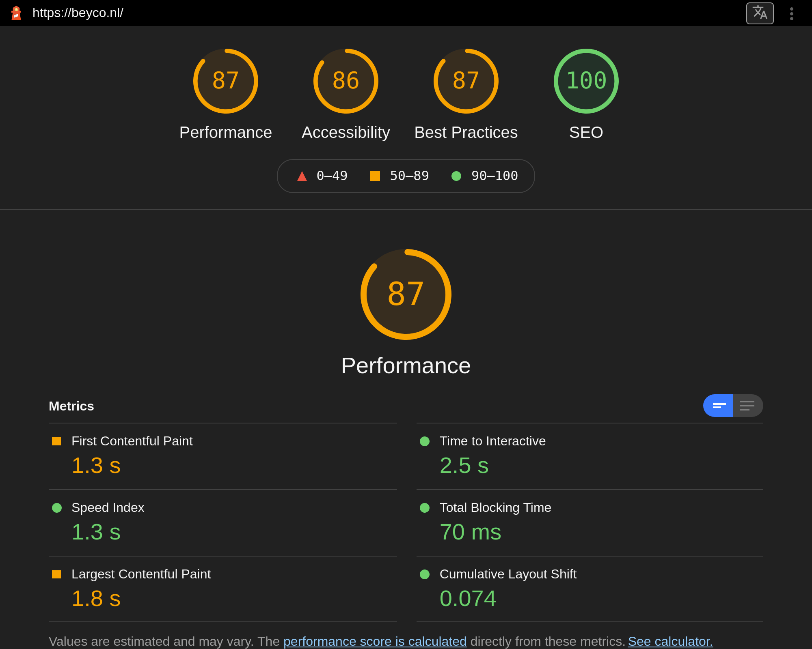
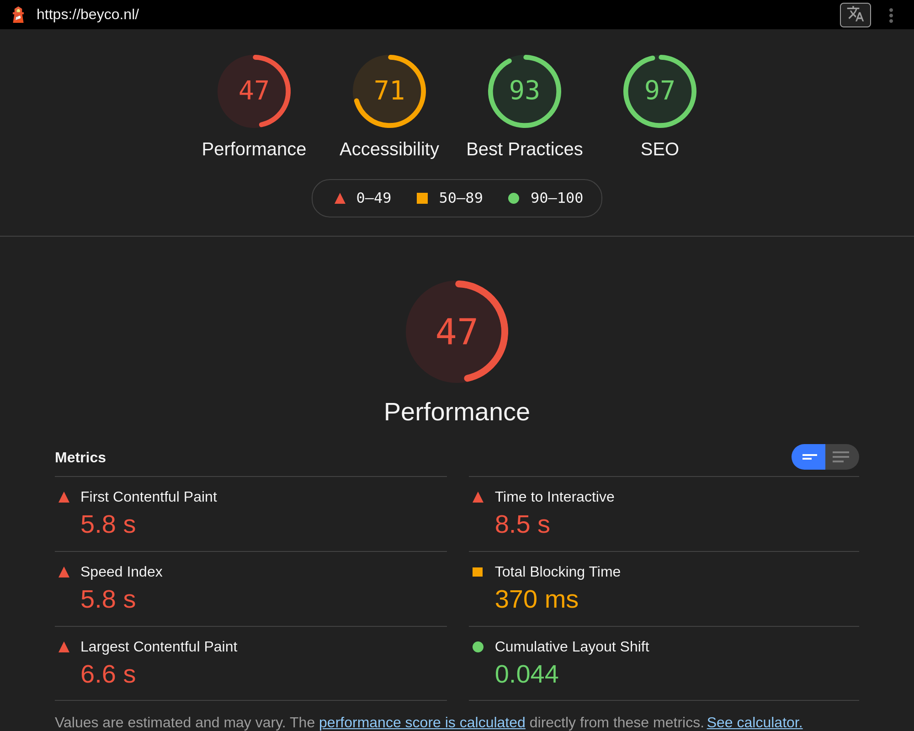
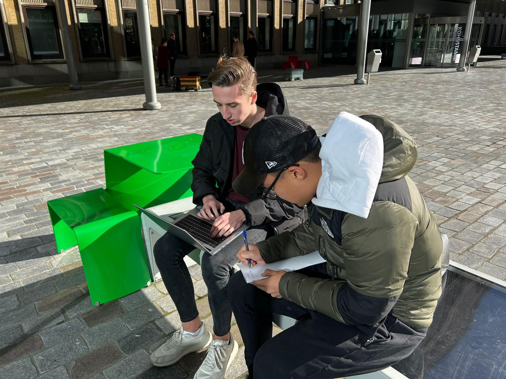
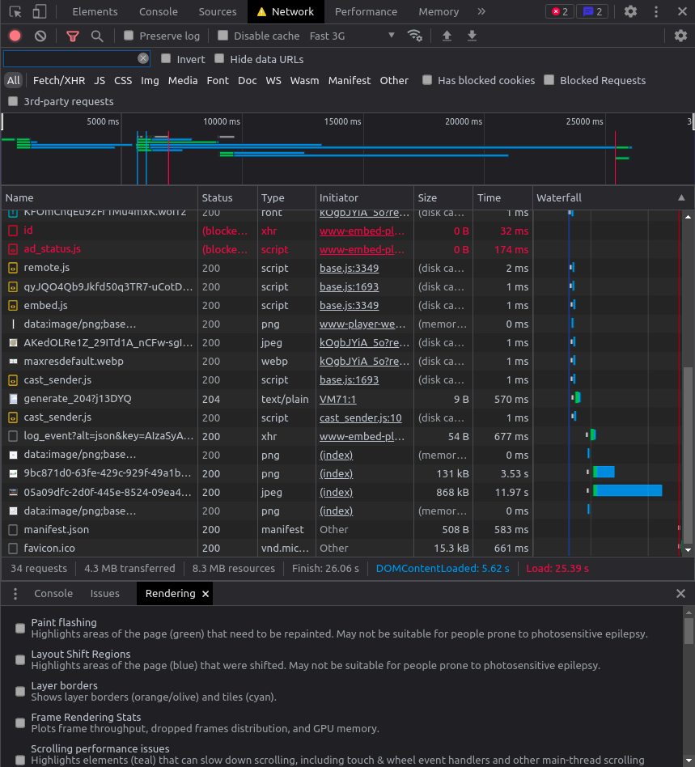
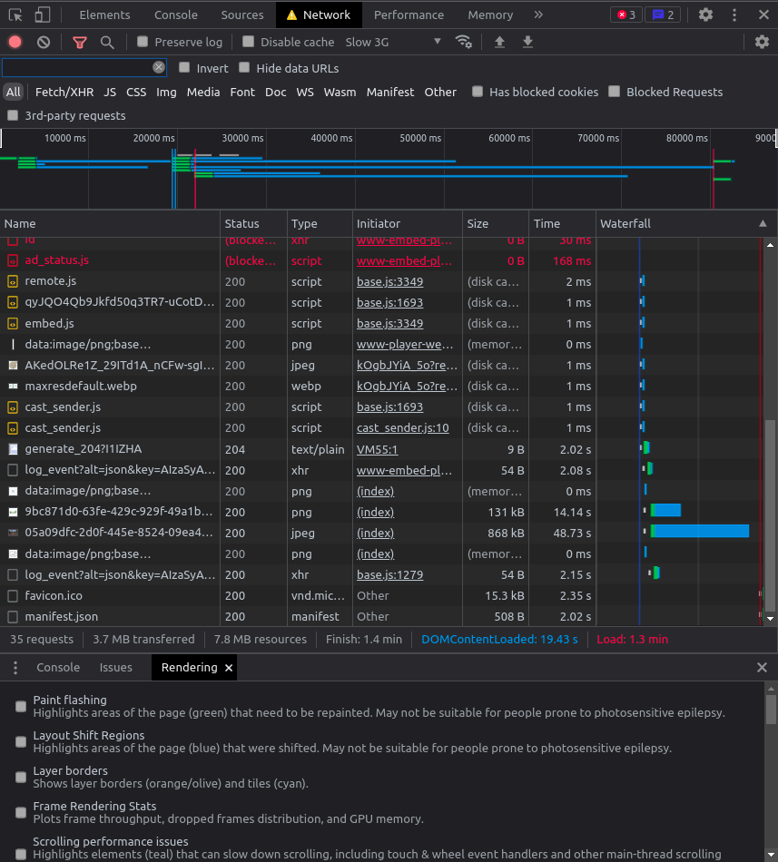

# Rapportage webtoegankelijkheid-test voor Chippr Beyco

Dit document is een webtoegankelijkheid-test volgens de Web Content Accessibility Guidelines (WCAG). Een consistente rapportage helpt bij het uitvoeren van een evaluatie en zorgt er voor dat verschillende tests kunnen worden vergeleken.

Datum webtoegankelijkheid-test: 27 oktober 2021, 28 oktober 2021, 1 november 2021,
2 november 2021

Webtoegankelijkheid-test uitgevoerd door: Justin Lung, Chaan Soekana, Armando Jubitana, Daan Korver, Daphne Zwuup & Finn van Bekkum

## Inhoudsopgave

- [Samenvatting](#samenvatting)
- [Achtergrond bij de evaluatie](#achtergrond_evaluatie)
- [Afbakening](#afbakening)
- [Testresultaten en aanbevelingen](#testresultaten_aanbevelingen)
- [Referenties](#referenties)
- [Bijlagen](#bijlagen)
- [Licentie](#licentie)

## Samenvatting

Dit rapport beschrijft in hoeverre de website [beyco.nl](https://www/beyco.nl) overeenstemt met de Web Content Accessibility Guidelines (WCAG) van het W3C. Na de achtergrondinformatie en afbakening van de test worden beoordelaars, beoordelingsproces en testresulltaten beschreven.

Conslusie van deze test luidt dat de Beyco website niet voldoet de WCAG 2.1, op niveau AA. Gedetailleerde resultaten en aanbevelingen zijn verderop in dit document beschikbaar en in de referenties vindt u bronnen voor eventuele vervolgstudie. Wij stellen feedback op deze evaluatie zeer op prijs.

## Achtergrond bij de evaluatie

De webtoegankelijkheid-test vereist een combinatie van semi-geautomatiseerde en handmatig uitgevoerde evaluatie tools door een ervaren beoordelaar. De beoordelingsresultaten in dit rapport zijn gebaseerd op een beoordeling welke is uitgevoerd op 28-10-2021. De website kan ondertussen aangepast zijn.

## Afbakening

[beyco.nl](https://www.beyco.nl)

Beyco is een platform waarbij je je koffie kan kopen en verkopen.

URLs die mee zijn genomen in de beoordeling:

- [www.beyco.nl](https://www.beyco.nl)
- [www.beyco.nl/trade/offers/public](https://beyco.nl/trade/offers/public)
- [www.beyco.nl/trade/offers/{offer_id}](https://beyco.nl/trade/offers/a648e729-9808-497f-a001-6e6e027f72a7)

Test data:

- 28-10-2021
- 29-10-2021
- 01-11-2021

Taal website: Engels

## Beoordelaars

Daan Korver  
Student  
daan.korver@hva.nl  
Nederlands

Justin Lung
Student
justin.lung@hva.nl
Nederlands

Daphne Zwuup
Student
daphne.zwuup@hva.nl
Nederlands

Finn van Bekkum
Student
finn.van.bekkum@hva.nl
Nederlands

## Beoordelingsproces

Deze beoordelings is uitgevoerd op WCAG 2.1 Niveau AA

De tools die zijn gebruikt voor deze beoordeling zijn de volgende:

- [A11Y Checklist](https://www.a11yproject.com/checklist/)
- [WCAG Guidelines Overview](https://www.w3.org/WAI/standards-guidelines/wcag/)
- [Google Lighthouse](https://developers.google.com/web/tools/lighthouse)

## Testresultaten en aanbevelingen

De huidige website van beyco voldoet niet nivea AA van de WCAG 2.1. Om deze score toch te behalen zijn er een paar aanbevelingen.

### Home Pagina

- Zorg dat labels de juiste attributen bevatten en dat er een duidelijke tekst in staat.
- Zorg dat het contrast van normale tekst een minimum ratio hebben van 4.5:1 en die van grote teksten een minimum 3:1
- Zorg dat alle elementen van de website altijd in beeld blijven, zelfs als je gaat zoomen.
- Zorg dat er geen horizontale scroll aanwezig is en dat de content niet naar de zijkant word gepushed op kleine schermen zoals Iphone 5
- Zorg dat er genoeg scroll ruimte is op mobile.

## Ontoegankelijke punten

### Home Pagina

- Label elementen missen het `for` attribuut en bevatten geen tekst
- In de footer is er een input om jezelf in te schrijven voor de nieuwsbrief. Als je hier een verkeerd email adress invoerd krijg je een error. Het contrast van deze error is niet goed.
- Bij 200% Zoom gaan sommige elementen uit het beeld. Dit geld vooral voor het kopje van "Search for coffees"
- Het contrast van de groene en witte/grijze kleur is niet goed genoeg.
- Op kleinere telefoons zoals Iphone 5 is er aan de rechterkant witruimte die zich over de hele lengte van de site verspreid.
- Bij de sectie van "Search your coffees" is er niet genoeg ruimte voor de gebruiker om te scrollen. Het zou zo maar kunnen dat je perongeluk 1 van de bedrijven aanklikt waardor je weer terug moet gaan naar de vorige pagina.

### Koffie Pagina

- Na het invoeren van een input veld, krijg je een error message te zien. Deze error message wordt alleen met tekst aangeduid. Dit kan worden verbeterd doormiddel van kleur (Een rooie kleur zou goed zijn om aan te duiden dat er geen zoekresultaten zijn). Hierdoor verbeterd de accessibility voor mensen met een beperking ook.

### Checklist

#### Content

#### Global code

#### Keyboard

#### Images

#### Headings

#### Lists

#### Controls

#### Tables

#### Forms

##### Koffie Pagina

- **All inputs in a form are associated with a corresponding label element.**
  Alle inputs in een form, worden geassocieerd met een label element. Echter kan het nog verbeterd worden om de input types bij een label een for/id te geven zodat de hoogste technologie van een browser het wordt support.
- **Use fieldset and legend elements where appropriate.**
  Er worden goed gebruik gemaakt van fieldsets & legends.
- **Inputs use autocomplete where appropriate.**
  Er wordt gebruikt gemaakt van een autocomplete bij een input waarbij nodig is.
- **Make sure that form input errors are displayed in list above the form after submission.**
  Er wordt gebruikt gemaakt van error handling. Als er geen zoekresultaten zijn, wordt dit duidelijk in tekst aangeduid dat er geen zoekresultaten zijn na het invullen van de input.
- **Associate input error messaging with the input it corresponds to.**
  Er wordt geen gebruik gemaakt van een aria-describedby om de inputs te laten associeren.
- **Make sure that error, warning, and success states are not visually communicated by just color.**
  Bij een error message, wordt het alleen met tekst aangeduid. Dit kan worden verbeterd doormiddel van kleur (Een rooie kleur zou goed zijn om aan te duiden dat er geen zoekresultaten zijn).

##### Home Pagina

- **All inputs in a form are associated with a corresponding ` <label>` element.**  
  Label elementen missen het `for` attribuut en bevatten geen tekst
- **Make sure that error, warning, and success states are not visually communicated by just color.**  
  Het contrast van de error is niet goed.

#### Media

##### Koffie Pagina

n.v.t.

#### Video

##### Koffie Pagina

n.v.t.

#### Audio

##### Koffie Pagina

n.v.t.

#### Appearance

##### Koffie Pagina

- **Check your content in specialized browsing modes.**
  Wanneer je tools zoals Window High Contrast/Inverted Colors gebruikt, dan is de website nog steeds goed zichtbaar.
- **Increase text size to 200%.**
  Tekst is goed te lezen na het inzoomen naar 200%
- **Double-check that good proximity between content is maintained.**
  De content kan nog worden gelezen als mensen een screen zoom software gebruiken. Dit werd getest met behulp van de [strawtest](https://www.youtube.com/watch?v=S1j6CYT3kWA)
- **Make sure color isn't the only way information is conveyed.**
  Links kunnen nog steeds gelezen worden na het gebruiken van een grayscale filter.
- **Make sure instructions are not visual or audio-only.**
  Er wordt geen audio gebruikt om instructies aan te duiden.
- **Use a simple, straightforward, and consistent layout.**
  De pagina heeft een logische layout verdeling

##### Home Pagina

- **Increase text size to 200%.**
  Bij 200% Zoom gaan sommige elementen uit het beeld.

#### Animation

##### Koffie Pagina

- **Ensure animations are subtle and do not flash too much.**
  Animaties zijn niet te "flashy". Ze worden subtiel afgespeeld.
- **Provide a mechanism to pause background video.**
  n.v.t
- **Make sure all animation obeys the prefers-reduced-motion media query.**
  Animaties worden niet in een prefers-reduced-motion media query gebruikt.

##### Home Pagina

n.v.t.

#### Color contrast

##### Koffie Pagina

- **Check the contrast for all normal-sized text.**
  De contrast ratio van een normnal sized text (zwarte #000000 op #FEFFFE ) is 20.9:1.

  Het contrast is dus nu enhanced naar een AAA resultaat. Normal-sized text is dus goed leesbaar op de pagina.

- **Check the contrast for all large-sized text.**
  De contrast ratio van large sized text (zwarte #000000 op #FEFFFE ) zijn 20.6.1.

  Het contrast is dus nu enhanced naar een AAA resultaat. large-sized text is dus goed leesbaar op de pagina.

- **Check the contrast for all icons.**

  Search Icon: grijs (#C6C8CA) op wit (#FEFFFE) heeft een contrast ratio van 1.7:1. Dit is dus niet goed zichtbaar.

  Dropdown icon: zwart (#000000) op wit (#FEFFFE) heeft een contrast ratio van 20.9:1. Dit is dus goed zichtbaar.

  Icon man: zwart (#000000) op grijs (#F5F7F9) heeft een contrast ratio van 19.6:1. Dit is dus goed zichtbaar.

  Page identifier: grijs (#8B8C8B) op wit (#FEFFFE) heeft een contrast ratio van 3.4:1. Dit is dus niet goed zichtbaar.

  Dropdown (port/export) icon: grijs (#CDCECD) op wit (#FEFFFE) heeft een contrast ratio van 1.6:1. Dit is dus niet goed zichtbaar.

- **Check the contrast of borders for input elements (text input, radio buttons, checkboxes, etc.).**
  Text Input: Contrast ratio voor de inputs is een 1.3:1. Dit betekent dus dat de contrast niet helemaal lekker loopt.
  Radio Button (after click state): De contrast van de UI component is een 4.5:1. De contrast is dus hierbij goed.
  Radio Button (before click state): De contrast van de UI component is een 1.2:1. De contrast is dus niet heel goed.
  Green CTA: De contrast ratio is een 4.5:1. Het voldoet aan de AA resultaat
  White CTA with green text: De contrast ratio is een 4.5:1. Het voldoet aan de AA resultaat
- **Check text that overlaps images or video.**
  n.v.t
- **Check custom ::selection colors.**
  n.v.t

##### Home Pagina

- **Check the contrast for all normal-sized text.**
  De lichtgroene kleur(#679d90) op grijs(#ebf2f1) heeft een contrast ratio van 2.72. Dit is geen goeie standaard als het gaat over contrast.
- **Check the contrast for all large-sized text.**  
  Het zelfde geld weer met de lichtgroene en grijze kleur. Het contrast ratio is niet hoog genoeg.
- **Check the contrast of borders for input elements (text input, radio buttons, checkboxes, etc.).**  
  Het contrast van de focus van inputs(#61998b) die staan op bijvoorbeeld een groene achtergrond(#679d90) is slecht zictbaar. Dit geld ook voor andere achtergrond kleuren.

#### Mobile and touch

##### Koffie Pagina

- **Check that the site can be rotated to any orientation.**
  De website kan goed geroteerd worden. Echter zijn er een aantal dingetjes die ik heb opgemerkt. Bij een koffie product, dit is een design keuze, maar de thumbnail van het product wordt niet laten zien en ziet de layout er niet goed uit. [Zie bijlage](#beyco-layout)

- **Remove horizontal scrolling.**
  Er is geen sprake van horizontal scrolling.
- **Ensure that button and link icons can be activated with ease.**
  Buttons en link iconen zijn goed klikbaar.
- **Ensure sufficient space between interactive items in order to provide a scroll area.**
  Er is genoeg ruimte om te scrollen voor mobiel.

##### Home Pagina

- **Remove horizontal scrolling.**  
  Op kleinere telefoons zoals Iphone 5 is er aan de rechterkant witruimte die zich over de hele lengte van de site verspreid.

- **Ensure sufficient space between interactive items in order to provide a scroll area.**  
  Bij de sectie van "Search your coffees" is er niet genoeg ruimte voor de gebruiker om te scrollen. Het zou zo maar kunnen dat je perongeluk 1 van de bedrijven aanklikt waardor je weer terug moet gaan naar de vorige pagina.

### Extra Tests

Naast de A11Y checklist zijn er ook nog een paar andere punten waarop wij hebben getest. Deze punten hebben wij besproken samen met de opdrachtgever (Chelsea).

#### Zonlicht

01-11-2021 hebben wij getest op zonlicht. Hieruit bleek dat het zeer slecht te zien was. Dit kwam doordat het contrast van de text niet goed genoeg was.
[Zie bijlage](#testen-in-de-zon)

#### Internet snelheid

Omdat beyco vaak word gebruik in landen zoals peru hebben wij ook getest op internet snelheid. Uit deze test is gebleken dat de website van beyco heel traag laad. Dit kan verbeterd worden doormiddel van image compression, code minifying en minder request maken naar grote files. [Zie bijlage](#fast-3g)

## Bijlagen

### Lighthouse Desktop

Dit is de huidige score van beyco zonder enige optimalisatie.

### Lighthouse Mobile

Dit is de huidige score van beyco zonder enige optimalisatie.

## Testen in de zon

We hebben ook nog getest in de zon op te checken op contrast.

## Fast 3G

Test met Fast 3G

## Slow 3G

Test met Slow 3G

## Beyco Layout

## Licentie

This work is licensed under [GNU GPLv3](./LICENSE).
